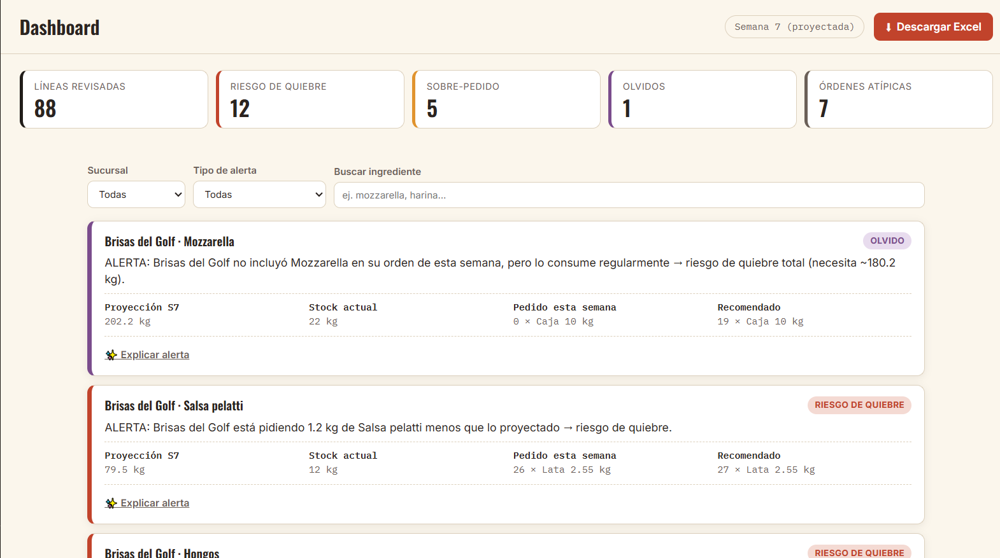
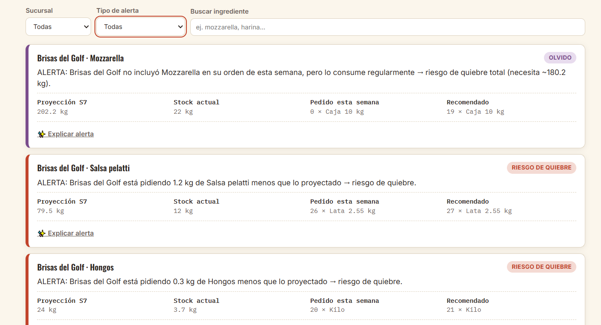
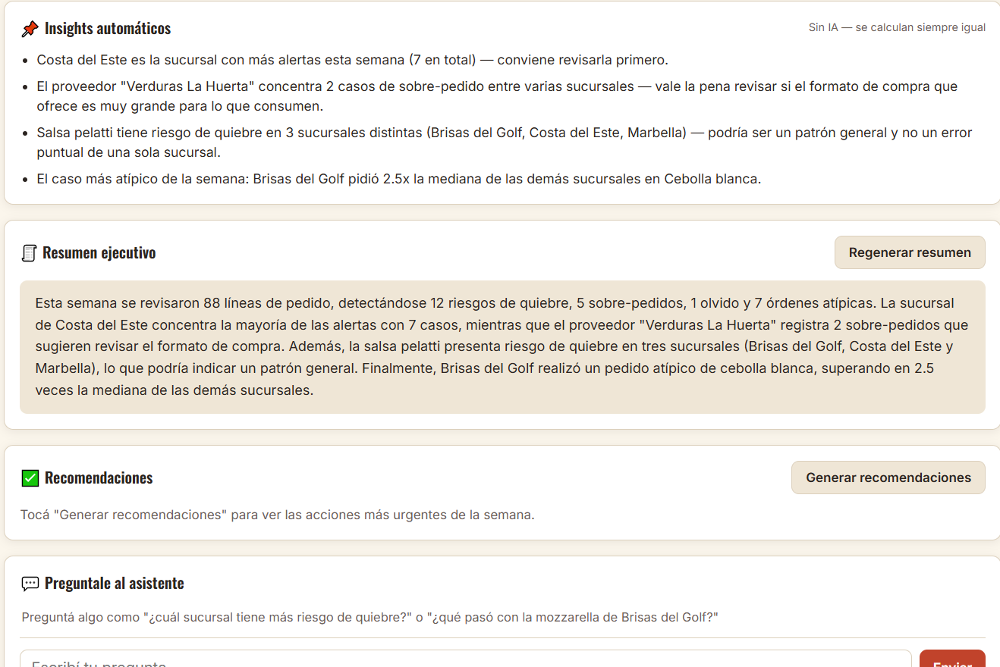
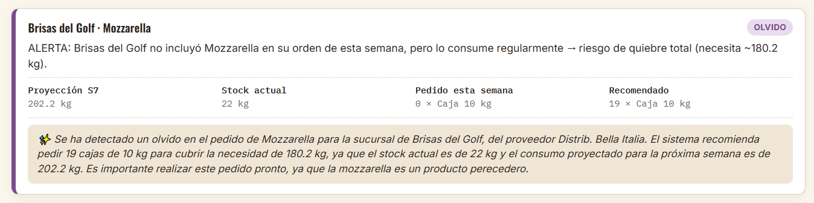
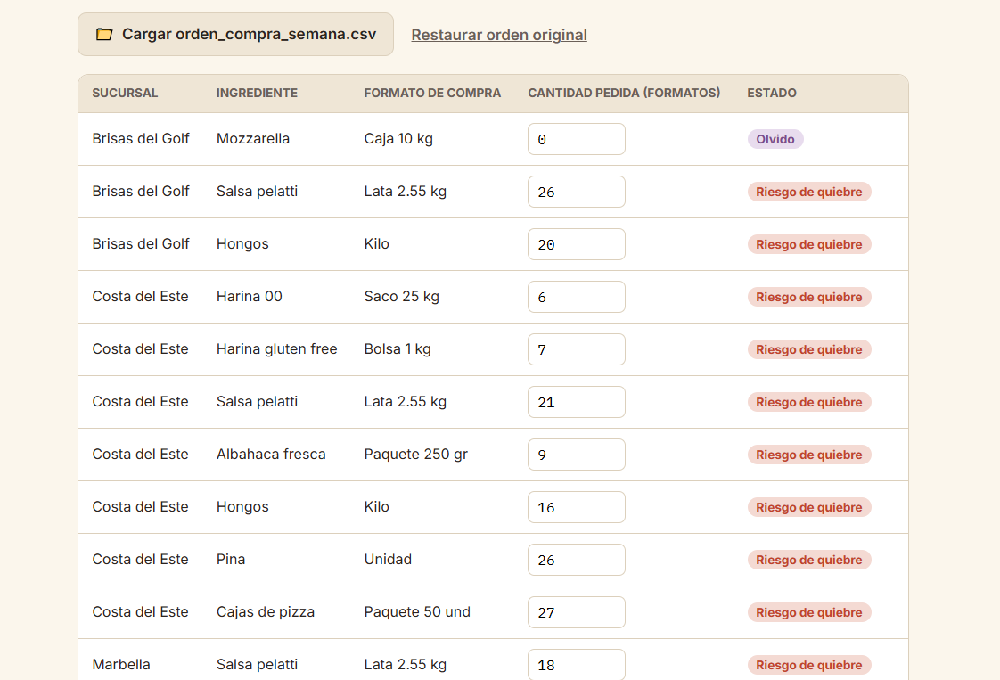

# 🍕 Sistema Inteligente de Validación de Órdenes de Compra

### Reto Técnico IA – Barrio Pizza

Una aplicación web que analiza automáticamente las órdenes de compra de las sucursales de Barrio Pizza para detectar riesgos de quiebre, sobrepedidos y oportunidades de optimización antes de aprobar una compra.

---

## 🌐 Demo

**Aplicación:** [reto-practicante.netlify.app](https://reto-practicante.netlify.app/)

**Video de demostración:** <LINK_VIDEO>

> ⚠️ Recordatorio: reemplazar `<LINK_VIDEO>` antes de entregar.

---

# 📌 El problema

Actualmente las órdenes de compra son revisadas manualmente por la Gerente de Compras.

Ese proceso consume tiempo y puede provocar errores como:

* Comprar más producto del necesario.
* Comprar menos de lo requerido.
* Inmovilizar capital en inventario.
* Quedarse sin ingredientes durante el servicio.

El objetivo de esta herramienta es automatizar ese análisis para que las alertas aparezcan inmediatamente después de cargar la información.

---

# 🚀 ¿Cómo funciona?

La aplicación procesa cuatro conjuntos de datos:

* Ingredientes
* Consumo histórico
* Inventario actual
* Orden de compra semanal

Con esta información:

1. Proyecta el consumo esperado.
2. Calcula la necesidad real considerando el inventario.
3. Convierte automáticamente las unidades base a formatos de compra.
4. Compara la orden propuesta con la compra recomendada.
5. Genera alertas claras para facilitar la toma de decisiones.

Todo el análisis se presenta mediante un dashboard pensado para que un usuario de negocio pueda entender el estado de las órdenes sin necesidad de revisar tablas manualmente.

---

# ✨ Funcionalidades implementadas

### Funcionalidades principales

* ✅ Carga de archivos CSV.
* ✅ Conversión automática de unidades.
* ✅ Proyección del consumo.
* ✅ Cálculo de compras recomendadas.
* ✅ Detección de riesgo de quiebre.
* ✅ Detección de sobrepedido.
* ✅ Dashboard interactivo.
* ✅ Indicadores (KPIs).
* ✅ Alertas visuales.

### Funcionalidades adicionales

* ✅ Tendencias de consumo (regresión lineal con detección de semanas atípicas).
* ✅ Detección de órdenes atípicas entre sucursales.
* ✅ Editor de órdenes desde la interfaz.
* ✅ Exportación de resultados a Excel.
* ✅ Explicación detallada de cada alerta.
* ✅ Visualización del cálculo realizado por el sistema.
* ✅ Asistente Inteligente (resumen ejecutivo, recomendaciones, insights automáticos, chat).
* ✅ Arquitectura híbrida IA + respaldo local.

---

# 🤖 Uso de Inteligencia Artificial

La IA fue utilizada como una herramienta de apoyo y **no como responsable de la lógica del negocio**.

El sistema está dividido en dos partes:

### Motor de Reglas

Se encarga de:

* proyectar el consumo;
* calcular necesidades;
* detectar riesgos;
* generar recomendaciones.

Todos estos cálculos son completamente determinísticos.

### Asistente Inteligente

El asistente utiliza IA para:

* explicar alertas;
* responder preguntas;
* resumir resultados;
* facilitar la interpretación del análisis.

La IA **nunca modifica los cálculos del sistema**.

Esto garantiza resultados consistentes y auditables.

---

# 🧠 Arquitectura híbrida

Para mejorar la confiabilidad del sistema se implementó una arquitectura híbrida.

```text
Archivos CSV
        │
        ▼
 Motor de Reglas
        │
        ▼
Resultados
        │
        ▼
 AssistantService
        │
   ┌────┴────┐
   │         │
   ▼         ▼
Gemini   Plantillas locales
```

Si el proveedor de IA está disponible, el asistente genera respuestas enriquecidas.

Si la IA no está disponible por cualquier motivo, el sistema cambia automáticamente a respuestas generadas mediante plantillas locales.

De esta manera la aplicación nunca deja de funcionar por depender de un servicio externo.

---

# 💡 Decisiones de diseño

Durante el desarrollo se tomaron las siguientes decisiones:

* Mantener la lógica de negocio completamente separada de la IA.
* Diseñar un sistema modular y desacoplado.
* Centralizar toda la interacción con IA mediante un `AssistantService`.
* Garantizar el funcionamiento del sistema incluso si la IA falla.
* Priorizar una interfaz orientada a usuarios de negocio y no a desarrolladores.

---

# 📂 Estructura del proyecto

```text
css/
├── styles.css

js/
├── dashboard.js
├── engine.js
├── data.js
├── upload-editor.js
├── xlsx-export.js
│
└── assistant/
    ├── assistant-service.js
    ├── assistant-config.example.js   ← plantilla (se sube al repo)
    ├── assistant-config.js           ← key real (NO se sube, ver .gitignore)
    ├── templates.js
    ├── insights.js
    └── providers/
        └── gemini-provider.js

index.html
```

---

# 🔍 Supuestos realizados

* El historial de consumo representa las últimas seis semanas completas.
* Los formatos de compra siempre son unidades completas.
* Un excedente menor a un formato completo se considera redondeo normal y no un sobrepedido.
* Los archivos cargados mantienen la estructura definida en el reto.

---

# 🏭 ¿Cómo lo integraría con Odoo?

Si esta solución se llevara a producción, el flujo sería el siguiente:

1. Odoo generaría las órdenes de compra.
2. La aplicación consumiría esa información mediante una API.
3. El motor analizaría automáticamente cada orden.
4. Las alertas y recomendaciones regresarían a Odoo antes de la aprobación final.

Esto permitiría que la Gerente de Compras revise únicamente las órdenes con alertas, reduciendo considerablemente el tiempo de validación.

---

# 🛠️ Tecnologías utilizadas

* HTML5
* CSS3
* JavaScript (ES6)
* SheetJS (XLSX)
* Gemini API
* Netlify

---

# ▶️ Cómo ejecutar el proyecto

## Opción 1

Abrir la aplicación publicada en Netlify.

## Opción 2

Clonar el repositorio:

```bash
git clone <URL_DEL_REPOSITORIO>
cd Reto_Practicante
```

Abrir el proyecto y ejecutar un servidor local (por ejemplo, Live Server en Visual Studio Code) — es necesario un servidor local (no abrir `index.html` con doble clic) para que la carga de módulos funcione correctamente.

Para que el Asistente Inteligente use IA real (y no solo las plantillas locales), copiar `js/assistant/assistant-config.example.js` como `js/assistant/assistant-config.js` y poner ahí tu propia API key de Gemini. Sin ese paso, la aplicación funciona igual, pero el asistente responde con las plantillas locales en vez de generar con IA.

---

# 📸 Capturas de pantalla

## 🖥️ Dashboard principal



---

## ⚠️ Panel de alertas



---

## 🤖 Asistente Inteligente



---

## 💡 Explicación de una alerta



---

## ✏️ Editor de órdenes



# 🔮 Posibles mejoras

* Pronósticos utilizando modelos de Machine Learning.
* Notificaciones por correo.
* Integración completa con Odoo mediante API.
* Historial de decisiones y auditoría.

---

# 👨‍💻 Autor

Desarrollado como parte del proceso de selección para el **Reto Técnico IA de Barrio Pizza**.

El objetivo principal fue construir una solución funcional, escalable y orientada a resolver un problema real de negocio, utilizando Inteligencia Artificial como apoyo para mejorar la interpretación de los resultados sin reemplazar la lógica del sistema.
